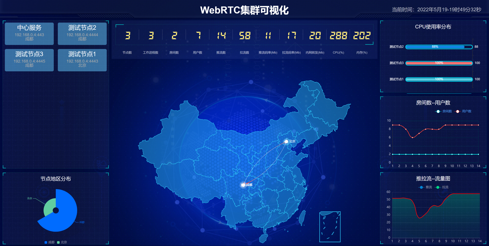

## 这是一个Mediasoup的集群项目
把开发一个【meidasoup极简的模块化的集群】的过程记录下来。

[项目地址：https://github.com/yangkang2021/mediasoup_cluster](https://github.com/yangkang2021/mediasoup_cluster)

## 出发点

1. mediasoup没有提供集群方案，只是隐约说到PipTransport可以实现
2. mediasoup没有完整的native客户端demo，如pc的qt，Android的java，ios的oc。

## 目标

1. 实现mediasoup集群商用部署
2. 要根据地域，运营商，优先级进行集群调度，区域用户隔离。
3. 要做到【命名空间】隔离不同的用户群。
4. 要做集群的可视化监控管理
5. 转发到传统直播如RTMP服务器做大规模直播。
6. 转发到存储服务器做存储，比如云存储。
7. 媒体和信令分离
8. 支持不同的部署模式：全球/全国/区域/私网/单机。
9. 全c++高性能服务器。
10. 调度和流量管理：redis/rabitmq/myqsl调度。
11. 支持单端口webrtc

## 方案对比

集群可以基于一下三个基础来做：

1. 基于房间：
   - 同一个房间调度到同一个服务器。
   - 全局对等节点。
   - 优劣：简单，信令和媒体都可以不改动；跨国有问题，无法做地域隔离和就近接入；room创建销毁要集群同步。
   - 最简单又有很多好处：
     - 比如同一个房间的所有数据和连接都在一台服务器，便于定位问题
     - 连接数减少网络出问题概率变小
     - 国内跨区域 跨运行商访问其实速度还可以
     - 内部的im通讯变得很容易做
2. 基于用户：
   - 同一个用户调度到同一个服务器。
   - 客户端只有收发两个transport，worker内部用pipeToRouter转发。
   - 优劣：全局管理room列表和服务端转发都比较复杂，服务转发太多带来复杂性。
3. 基于音视频流：
   - 同一个流掉才调度同一个服务器。
   - 用户需要创建很多个transport连接很多服务器。
   - 优劣：连接太多可能带来网络不稳定性，客户端复杂。

[参考连接](https://mediasoup.discourse.group/t/recommended-mediasoup-cluster-topology/1497)

## 方案选择与计划

### 第一步(V1.0) ：基于房间的集群，共四个模块。用户从调度中心获取节点后连接节点，节点上报状态和支持调度。

1. 多个对等通讯节点：沿用mediasoup-demo-server程序，
   - 扩展webscoket信令，支持集群管理。
   - 要定期向调度中心更新状态。
2. 全局一个调度中心：
   - 保证同一个room的用户分配到同一个服务器的同一个worker。
   - 创建room时候，做负载均衡，根据各个通讯节点的负载调度。
   - 新建房间时调度到第一个用户所在区域。
   - 也支持非集群部署，没有调度中心单点一样提供服务。
3. 集群可视化管理web

4. 四大客户端：pc，Android，ios，web
    

第二步(V2.0)：基于用户或者流。
- woker的接口从js改成c++
- 信令和媒体分离
- 单端口

## 开发过程：

1. V1.0开发

   - 开发工具：nodejs+webstrom+docker
   - docker部署多个demo。
   - 调度开发：直接基于demo的websocket，加入一个信令重定向命令：无差别的对待调度中心和通讯节点，同时兼容单机部署和集群。
   - 在demo加入redis共享room数据和监控数据。
   - 开发集群可视化管理模块：
     - 组织信息：名称，区域，ip，命名空间
     - 服务器信息：cpu，内存，网络带宽，硬盘
     - 服务信息：worker数，room数，用户数，流数，
     - 用户信息：用户id，带宽，地域。
2. V2.0开发：基于V1.0对media的了解
3. 私人联系方式

